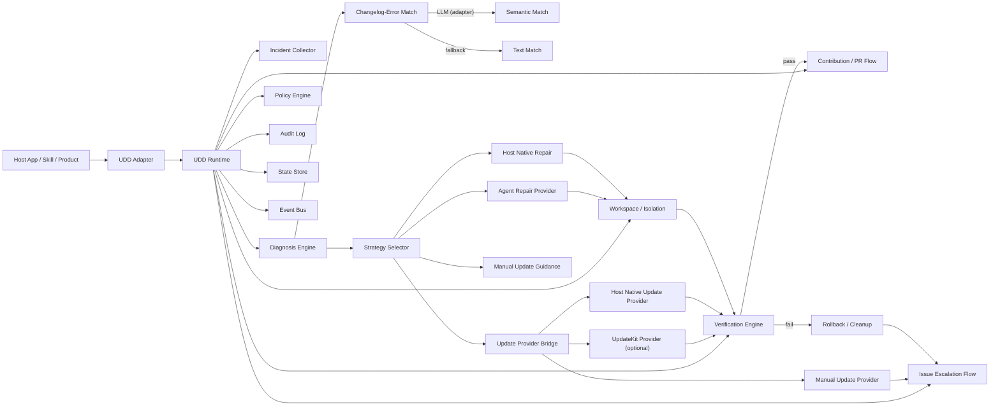

# UDD Kit

[中文说明](./README.zh-CN.md)

**UDD Kit** is a self-healing runtime for AI agent ecosystems. It detects failures, matches them against upstream fixes, attempts automated repair, and contributes fixes back upstream.

UDD = **User-Directed Development** -- software evolution driven by users and their agents, not just company roadmaps.

## Why We Build This

The traditional software model works like this: users report pain, companies filter and prioritize, companies decide what gets built. Users have voice but no agency.

AI has changed the equation. With coding agents, every user now has the power to build and adapt software locally -- instantly, without waiting for a company's roadmap. This is not just a productivity boost; it's a fundamental shift in who controls how software evolves.

We call this shift **User-Directed Development (UDD)**:

1. Users encounter a problem in their own context
2. Their agents collect evidence and attempt a safe local repair
3. Successful fixes flow back upstream as reusable improvements
4. Software evolves from the edges, not just from the center

But this loop doesn't close itself. When a user's agent fixes something locally, that knowledge stays local. When upstream releases a fix, users don't know it addresses their problem. When a repair breaks something, there's no rollback. When a fix is valuable, there's no path to contribute it back.

**UDD Kit is the orchestration layer that closes this loop.** It connects failure detection, upstream awareness, local repair, verification, and upstream contribution into a single automated cycle.

> *"Software should evolve from 'users report, companies decide' to 'users direct, agents execute, platforms govern the boundary.'"*

Read more: [The Future of Software: From User-Centric to User-Directed Development (LinkedIn)](https://www.linkedin.com/pulse/future-software-from-user-centric-user-directed-development-eli-wang-ucx8c/)

## Quick Start (Agent Environment -- Recommended)

For products used by AI agents (Claude Code, Codex, etc.), integration is **zero code**:

```bash
npm install -g udd-kit
cd /path/to/your/product
udd init
```

`udd init` does two things:
1. Generates `udd.config.json` (auto-detects repo, language, version source)
2. Outputs a ready-to-use **Self-Healing Protocol** prompt -- copy it into your agent instructions (CLAUDE.md, AGENT_INSTRUCTIONS.md, system prompt, etc.)

That's it. When the agent encounters a failure, it spawns a subagent to run UDD diagnostics and repair in isolation.

## Quick Start (Programmatic)

For CI/CD, background monitors, or non-agent environments:

```ts
import { initUdd } from "udd-kit/quick";

const { runtime, adapter } = await initUdd({ name: "my-app" });

// Check if upstream already fixed your problem
const check = await runtime.check(adapter);
if (check.upstreamFixMatch) {
  console.log(check.upstreamFixMatch.recommendation);
}

// Subscribe to events
runtime.events.on("update:fixes-local-error", ({ match, update }) => {
  console.log(`Upstream ${update.latestVersion} fixes this: ${match.recommendation}`);
});

// Background health monitor
runtime.watch(adapter, { intervalMs: 300_000 });
```

## Core Loop

```
Error occurs → Collect incident → Diagnose (LLM semantic match or text fallback)
  → Select strategy → Repair in isolated worktree → Verify with hooks
    → Success: submit PR upstream
    → Failure: escalate as issue with redacted diagnostics
```

## Two Integration Paths

| | Agent (Prompt) | Programmatic |
|---|---|---|
| How | `udd init` + paste prompt | `initUdd()` + adapter code |
| Semantic matching | Agent's own LLM | Built-in text matching (or adapter override) |
| Recursive dependency | Subagent isolation | N/A |
| Best for | Products used by AI agents | CI/CD, cron jobs, web services |

## Architecture



## Key Features

- **Changelog-error matching**: Compares local errors against upstream release notes to detect if your problem is already fixed upstream. Uses adapter-provided LLM semantic matching in agent environments, with deterministic text matching as fallback.
- **Self-healing loop**: Diagnose → strategy → repair → verify → contribute/escalate, fully automated.
- **Isolated repair**: All repairs happen in git worktrees. Verification must pass before promotion.
- **Event system**: Subscribe to `update:available`, `update:fixes-local-error`, `heal:completed`, etc.
- **Watch mode**: `runtime.watch()` for background health monitoring with event-driven notifications.
- **Privacy-aware**: Redacts tokens, secrets, and absolute paths before creating issues or PRs.
- **Zero runtime dependencies**: Built entirely on Node.js built-ins.

## CLI

```bash
udd init [--repo owner/name] [--force]       # Generate config + agent prompt
udd check [--json]                            # Check upstream for updates
udd analyze --error "msg" [--json]            # Diagnose an error
udd heal --error "msg" --decision repair_once # Full self-heal loop
udd issue-draft --error "msg" [--out f.md]    # Draft an issue
udd contribute-draft --summary "fix" [--out]  # Draft a contribution
udd state [--json]                            # View persisted state
udd audit [--limit 20] [--json]              # View audit records
```

## Runtime API

```ts
runtime.check(adapter)           // Check upstream + changelog-error matching
runtime.analyze(adapter)         // Diagnose an incident
runtime.planHeal(adapter)        // Preview the healing plan
runtime.heal(adapter)            // Execute full self-healing loop
runtime.watch(adapter, options)  // Background health monitor
runtime.events.on(event, fn)     // Subscribe to events
runtime.getState(adapter)        // Read persisted state
runtime.getAudit(adapter)        // Read audit records
```

## Adapter Interface

The adapter translates your host environment into UDD's context. All methods except `getContext` are optional:

```ts
import { defineAdapter } from "udd-kit/adapter";

const adapter = defineAdapter({
  name: "my-app",
  getContext: () => ({ cwd, appName, error, confirm }),

  // Optional: LLM-powered semantic matching (agent environments)
  matchUpstreamFix: (req) => /* compare req.error with req.highlights */,

  // Optional: let an agent repair code in isolated worktree
  invokeRepairAgent: (req) => /* return { ok, summary, changedFiles } */,

  // Optional: provide update strategies
  getUpdateProviders: () => [/* update-kit, host-native, manual */],

  // Optional: custom decision logic
  decide: (prompt) => /* return UddDecision */,
});
```

## Documentation

- [Integration Guide](./docs/INTEGRATION.md) -- Programmatic integration details
- [Agent Instructions Template](./docs/AGENT_INSTRUCTIONS.md) -- Prompt integration reference
- [UDD Design Philosophy (Chinese)](./docs/UDD-DESIGN-PHILOSOPHY.zh-CN.md)

## License

MIT
