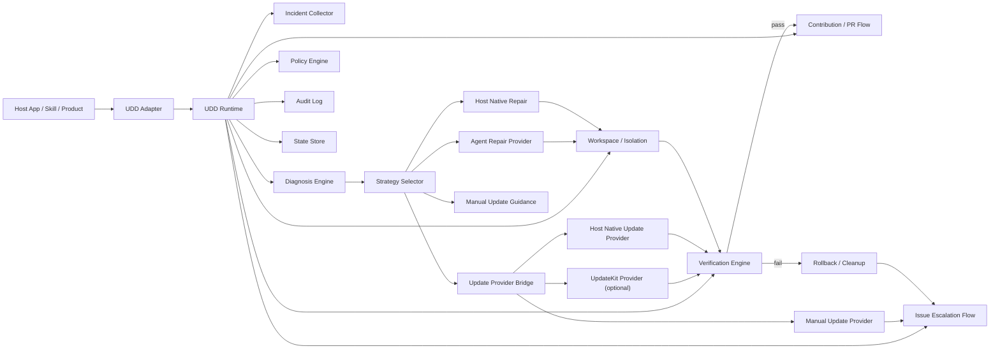

# UDD Kit

[中文说明](./README.zh-CN.md)

`UDD Kit` is an embeddable runtime for **User-Directed Development**.

Its core job is not "show upgrade notifications". Its core job is to help host products turn real user pain into a closed-loop evolution cycle:

- identify problems from real usage
- diagnose what kind of problem this is
- attempt local self-healing through an injected repair agent or update path
- verify the result in a controlled workspace
- send the outcome upstream as an issue or a PR

In UDD, users are not limited to reporting needs. Users, together with their agents, direct how software evolves.

## What UDD Means

Traditional software delivery is company-directed:

1. users report pain
2. the company filters and prioritizes
3. the company decides what gets built

UDD changes the control point:

1. users encounter a problem in context
2. the host product and its agents collect evidence
3. the system attempts a safe local repair or update
4. successful fixes can flow back upstream as reusable improvements

`UDD Kit` is the orchestration layer for that loop.

## Core Loop

`UDD Kit` is built around this self-healing and upstream contribution cycle:

1. Collect the incident: error, logs, environment, git state, and upstream version state.
2. Diagnose the incident and choose a repair strategy.
3. Attempt repair through:
   - a host-provided coding agent
   - an optional `UpdateKit` provider
   - a host-native update provider
   - a manual update path
4. Run verification hooks in an isolated workspace.
5. If verification passes, prepare or submit a PR.
6. If repair fails, escalate as an issue with redacted diagnostics.

## Architecture



## Main Capabilities

- Incident collection: gather error context, logs, environment metadata, git state, and version state.
- Diagnosis: classify failures and choose a repair strategy.
- Local self-healing: call a host-provided repair agent to modify code in an isolated workspace.
- Update bridge: prefer `UpdateKit` when available, otherwise fall back to host-native or manual update paths.
- Verification: run preflight, test, smoke, and compatibility hooks before promotion.
- Upstream contribution: draft or submit issues and PRs with redacted diagnostics and structured context.
- State and audit: persist decisions, ignored versions, last heal results, and audit records.

## Why GitHub Update Detection Still Exists

GitHub update detection is still part of `UDD Kit`, but it is now a **supporting signal**, not the product's headline purpose.

It stays because it serves four important roles:

1. It helps diagnosis decide whether a problem is better solved by an upstream update than by patching local code.
2. It powers the optional update strategy when a host has `UpdateKit` or another update provider.
3. It gives hosts without `UpdateKit` a minimal fallback path: detect upstream change and guide the user to fetch or upgrade manually.
4. It remains useful on its own for hosts that only want awareness and policy decisions around upstream drift.

So the right framing is:

- `UDD Kit` is primarily about **problem recognition, local self-healing, and upstream contribution**
- upstream version checks are one diagnostic input and one possible repair path inside that broader loop

## Install

```bash
npm install udd-kit
```

## Config

Default manifest file:

- `udd.config.json`

Legacy compatible file name:

- `agent-upgrade.json`

Start from:

- [udd.config.example.json](./udd.config.example.json)
- [agent-upgrade.example.json](./agent-upgrade.example.json)

## Minimal Example

```ts
import { defineAdapter } from "udd-kit/adapter";
import { createRuntime } from "udd-kit/runtime";

const adapter = defineAdapter({
  name: "my-host",
  async getContext() {
    return {
      cwd: process.cwd(),
      appName: "my-host",
      logs: ["./logs/latest.log"],
      error: {
        message: "dependency mismatch during startup"
      },
      confirm: async () => true
    };
  },
  async decide(prompt) {
    if (prompt.kind === "update") return "update_once";
    return "repair_once";
  },
  async invokeRepairAgent(request) {
    return {
      ok: true,
      summary: "patched the failing workflow",
      changedFiles: ["src/fix.ts"]
    };
  }
});

const runtime = await createRuntime({ cwd: process.cwd() });
const result = await runtime.heal(adapter);

console.log(result.status);
```

## CLI

The self-healing loop is now the primary CLI surface:

```bash
udd analyze --manifest ./udd.config.json --error "Request failed"
udd heal --manifest ./udd.config.json --error "Request failed" --decision repair_once
udd state --manifest ./udd.config.json
udd audit --manifest ./udd.config.json --limit 20
```

Supporting commands remain available:

```bash
udd check --manifest ./udd.config.json
udd issue-draft --manifest ./udd.config.json --error "Request failed" --log ./logs/latest.log
udd contribute-draft --manifest ./udd.config.json --summary "Fixed retry loop"
udd ignore --manifest ./udd.config.json --version 1.2.3
```

Legacy alias:

```bash
agent-upgrade check --manifest ./agent-upgrade.json
```

## Public Runtime APIs

- `runtime.analyze(adapter)`
  Diagnose an incident and suggest repair strategies.
- `runtime.planHeal(adapter)`
  Produce a healing plan, including strategy and optional update provider selection.
- `runtime.heal(adapter)`
  Execute the full self-healing loop and return `repaired`, `escalated`, or `skipped`.
- `runtime.getState(adapter)` / `runtime.getAudit(adapter)`
  Read persisted state and audit records.
- `runtime.check(adapter)`
  Inspect upstream version drift when the host needs it.

## Design Philosophy

- [UDD Design Philosophy (Chinese)](./docs/UDD-DESIGN-PHILOSOPHY.zh-CN.md)

The design argument behind `UDD Kit` is simple:

> software should evolve from "users report, companies decide" to "users direct, agents execute, platforms govern the boundary"

## Integration Guide

- [Integration Guide](./docs/INTEGRATION.md)

## Notes

- GitHub write operations still require an explicit host decision path.
- Audit and state files are intended to remain local host artifacts and are filtered from contribution drafts.
- New capabilities should keep evolving through `runtime`, manifest, and adapter boundaries rather than forcing host rewrites.
