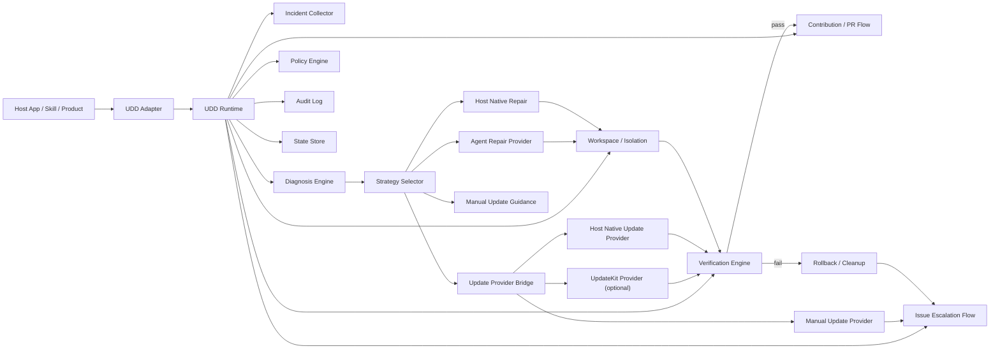

# UDD Kit

[English README](./README.md)

`UDD Kit` 是一个可嵌入到宿主产品中的 **用户主导开发（User-Directed Development）运行时**。

它的核心不是“提示用户有新版本可升级”，而是帮助宿主把真实用户问题转成一个闭环：

- 识别问题
- 诊断问题类型
- 在本地发起自愈
- 在受控环境里验证结果
- 把结果回流到上游，形成 issue 或 PR

也就是说，`UDD Kit` 的重点是：

**问题识别 + 本地自愈 + 上游提交**

在 UDD 里，用户不再只是提需求的人。用户和他背后的 Agent，开始共同主导产品如何演进。

## 什么是 UDD

传统软件研发是公司主导的：

1. 用户提反馈
2. 公司筛选需求
3. 公司决定优先级和排期
4. 公司交付版本

UDD 改变的是控制权：

1. 用户在真实场景中遇到问题
2. 宿主产品和 Agent 收集证据
3. 系统尝试安全的本地修复或更新
4. 成功的修复再回流为 issue、PR 或生态能力

`UDD Kit` 就是这条链路的编排层。

## 核心闭环

`UDD Kit` 围绕这条自愈和回流闭环工作：

1. 收集 incident：错误、日志、环境、git 状态、上游版本状态。
2. 诊断 incident，并选择修复策略。
3. 尝试修复，策略可能包括：
   - 宿主注入的编码 Agent
   - 可选的 `UpdateKit`
   - 宿主原生更新能力
   - 手动更新路径
4. 在隔离工作区中运行 verification hooks。
5. 如果验证通过，则准备或提交 PR。
6. 如果修复失败，则生成脱敏 issue 并向上游回报。

## 架构图



## 主要能力

- 问题识别：采集错误、日志、环境、git 状态和版本状态。
- 问题诊断：判断更像代码 bug、配置问题、上游更新问题，还是未知问题。
- 本地自愈：调用宿主注入的 Agent，在隔离工作区里做本地修复。
- 更新桥接：优先使用 `UpdateKit`，否则退回宿主原生更新器或手动更新提示。
- 验证与拦截：执行 preflight、test、smoke、compatibility hooks。
- 上游回流：生成或提交 issue / PR，把修复结果回流到原仓库。
- 状态与审计：记录决策、忽略版本、最近一次自愈结果和结构化审计日志。

## 为什么还保留“检查 GitHub 仓库更新并提示升级”

这个能力现在仍然保留，但它已经不是 `UDD Kit` 的 headline 功能，而是一个**辅助能力**。

它保留的原因有四个：

1. 它是诊断信号之一。系统需要知道“问题是否可能通过上游更新解决”。
2. 它是更新策略的入口。当宿主接了 `UpdateKit` 或其他更新器时，版本检查会触发更新修复路径。
3. 它是兜底路径。即使宿主没有 `UpdateKit`，`UDD Kit` 仍然可以识别“上游变了”，并提醒用户手动 fetch / update / install。
4. 它仍然有独立价值。有些宿主只需要知道本地是否落后于上游，但不想自动执行更新。

所以更准确的定位应该是：

- `UDD Kit` 的核心是 **识别问题、发起本地自愈、把结果回流到上游**
- GitHub 更新检查只是这条闭环中的一个诊断输入和一个潜在修复路径

## 安装

```bash
npm install udd-kit
```

## 配置

默认 manifest 文件名：

- `udd.config.json`

兼容旧文件名：

- `agent-upgrade.json`

可以从这些示例开始：

- [udd.config.example.json](./udd.config.example.json)
- [agent-upgrade.example.json](./agent-upgrade.example.json)

## 最小接入示例

```ts
import { defineAdapter } from "udd-kit/adapter";
import { createRuntime } from "udd-kit/runtime";

const adapter = defineAdapter({
  name: "my-host",
  async getContext() {
    return {
      cwd: process.cwd(),
      appName: "my-host",
      logs: ["./logs/latest.log"],
      error: {
        message: "dependency mismatch during startup"
      },
      confirm: async () => true
    };
  },
  async decide(prompt) {
    if (prompt.kind === "update") return "update_once";
    return "repair_once";
  },
  async invokeRepairAgent(request) {
    return {
      ok: true,
      summary: "patched the failing workflow",
      changedFiles: ["src/fix.ts"]
    };
  }
});

const runtime = await createRuntime({ cwd: process.cwd() });
const result = await runtime.heal(adapter);

console.log(result.status);
```

## CLI

现在最主要的 CLI 命令是自愈相关命令：

```bash
udd analyze --manifest ./udd.config.json --error "Request failed"
udd heal --manifest ./udd.config.json --error "Request failed" --decision repair_once
udd state --manifest ./udd.config.json
udd audit --manifest ./udd.config.json --limit 20
```

辅助命令仍然保留：

```bash
udd check --manifest ./udd.config.json
udd issue-draft --manifest ./udd.config.json --error "Request failed" --log ./logs/latest.log
udd contribute-draft --manifest ./udd.config.json --summary "Fixed retry loop"
udd ignore --manifest ./udd.config.json --version 1.2.3
```

兼容旧命令：

```bash
agent-upgrade check --manifest ./agent-upgrade.json
```

## 公开 Runtime API

- `runtime.analyze(adapter)`
  诊断 incident 并给出修复策略建议
- `runtime.planHeal(adapter)`
  生成自愈计划，包括修复策略和可选 Update Provider
- `runtime.heal(adapter)`
  执行完整自愈闭环，返回 `repaired` / `escalated` / `skipped`
- `runtime.getState(adapter)` / `runtime.getAudit(adapter)`
  读取持久状态和审计记录
- `runtime.check(adapter)`
  在宿主需要时检查上游版本漂移

## 设计理念文档

- [UDD 设计理念说明（中文）](./docs/UDD-DESIGN-PHILOSOPHY.zh-CN.md)

这套工具背后的核心观点是：

> 软件不应再停留在“用户反馈，公司决定”的单向模式，而应该转向“用户决定方向，Agent 执行建造，平台负责边界治理”的新范式。

## 集成说明

- [Integration Guide](./docs/INTEGRATION.md)

## 备注

- GitHub 写操作依然应该经过宿主明确决策。
- 审计和状态文件默认是宿主本地工件，不应进入 contribution draft。
- 新能力优先通过 `runtime`、manifest 和 adapter 边界演进，而不是要求宿主重写接入代码。
